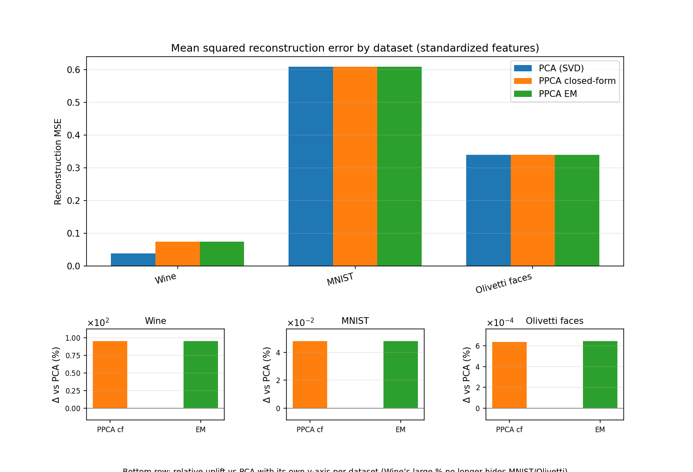
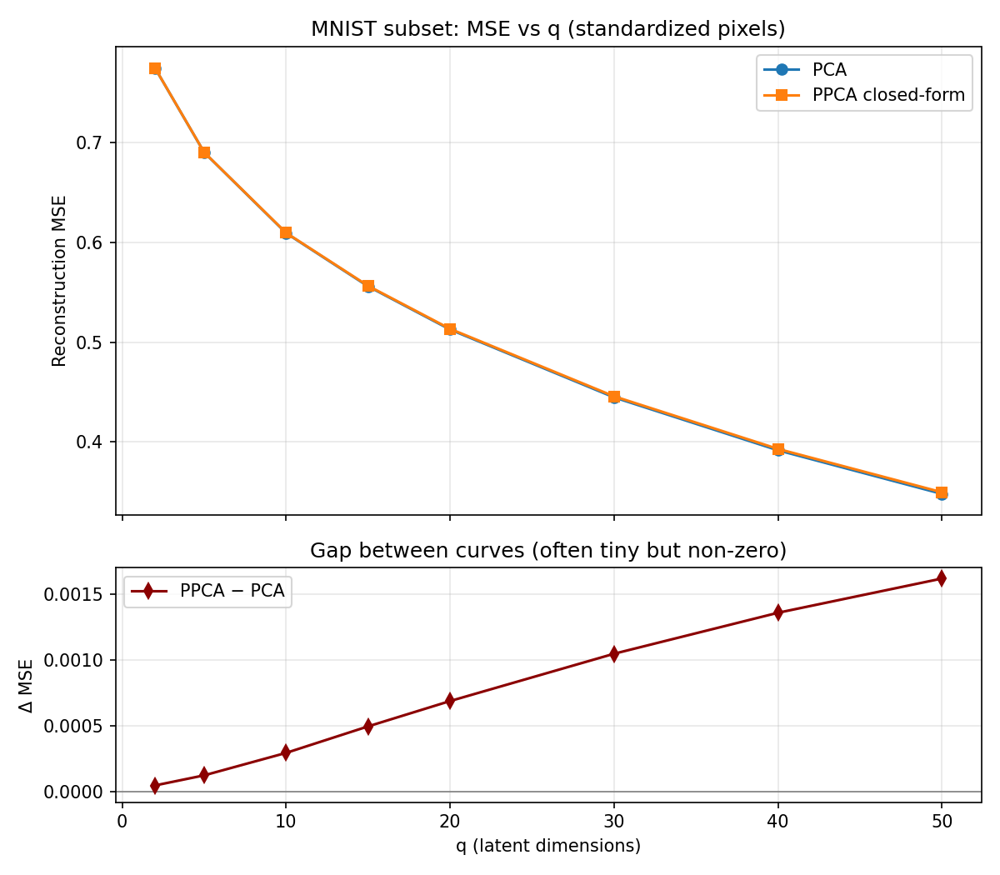
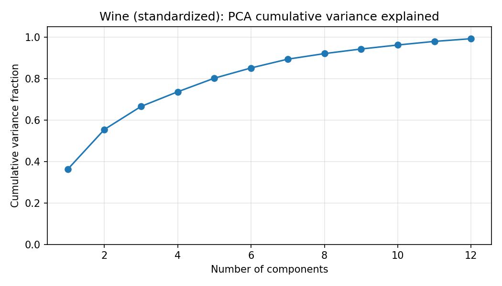
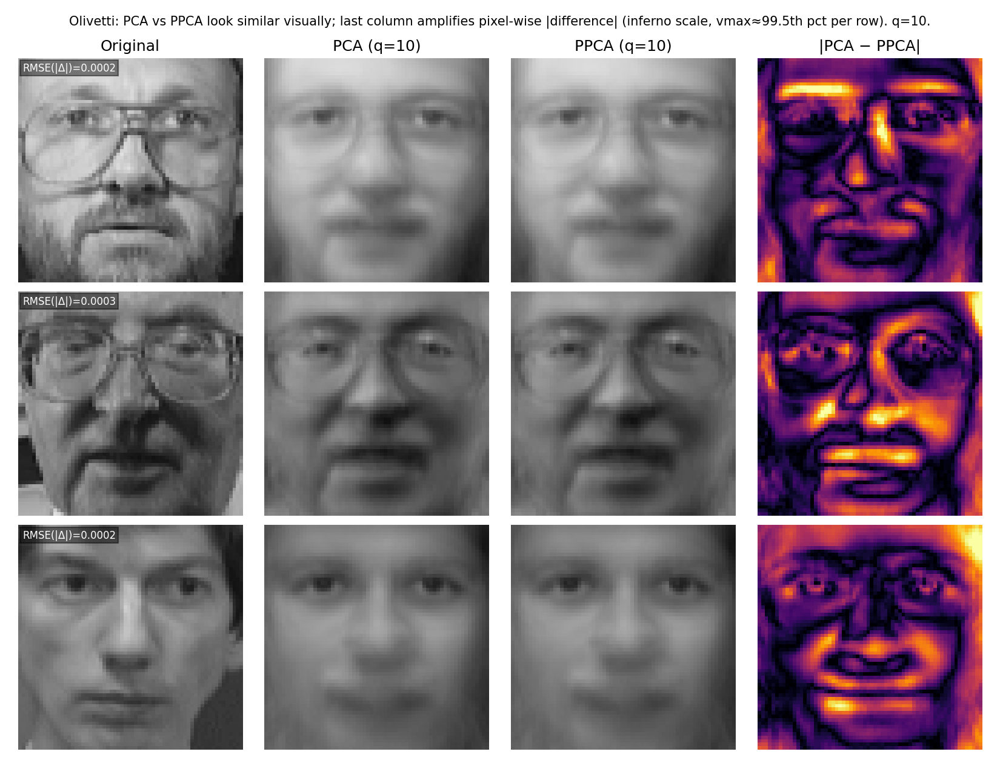
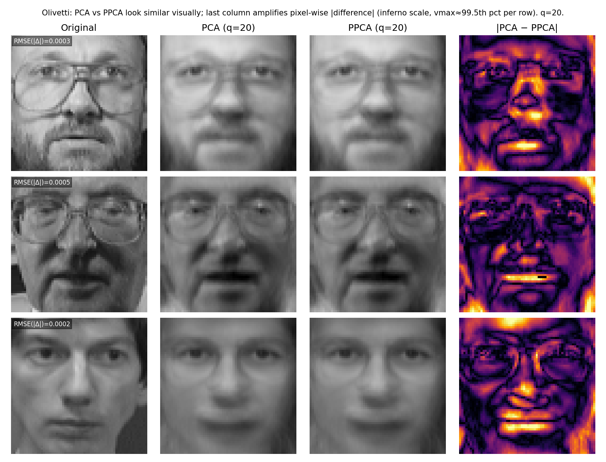
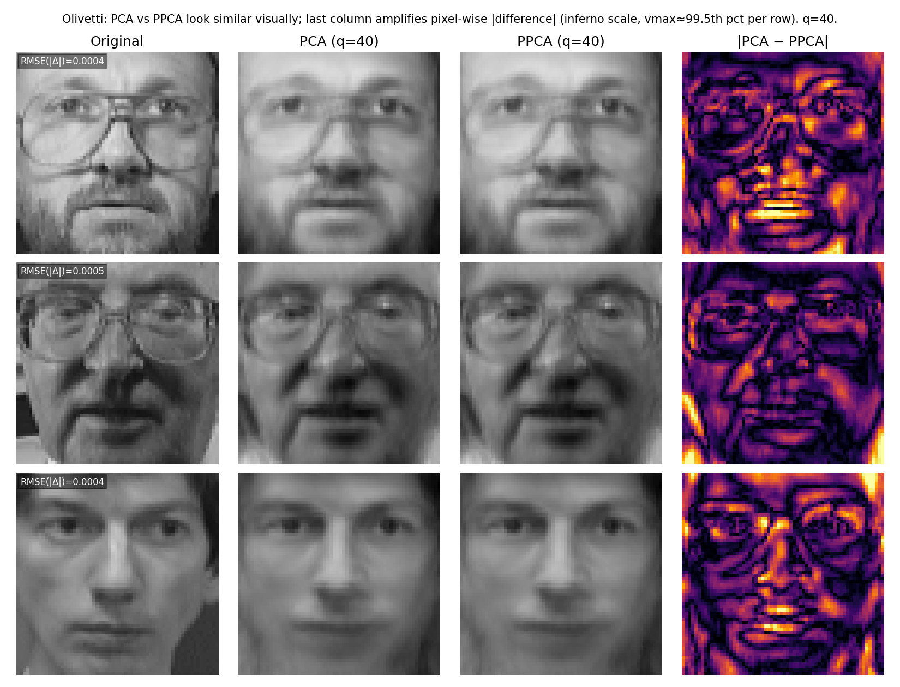

<!-- _class: lead -->

# Probabilistic Principal Component Analysis

**Michael E. Tipping & Christopher M. Bishop**  
*Journal of the Royal Statistical Society, Series B*, 61(3), 611–622 (1999)

**Brandon Jackson** — CS6310 course project

**Model family:** linear Gaussian latent factor model  
$\mathbf{x} = \mathbf{W}\mathbf{z} + \boldsymbol{\mu} + \boldsymbol{\varepsilon}$,  
$\mathbf{z} \sim \mathcal{N}(\mathbf{0}, \mathbf{I})$, $\boldsymbol{\varepsilon} \sim \mathcal{N}(\mathbf{0}, \sigma^2 \mathbf{I})$

---

## Problem & paper overview

- **Setting:** Observe high-dimensional $\mathbf{x}_i \in \mathbb{R}^D$; seek a **low-dimensional** explanation plus noise (dimensionality reduction + denoising narrative).
- **PCA** gives the optimal **orthogonal projection** subspace for reconstruction variance—but **no unified probabilistic story** for noise vs signal.
- **PPCA** replaces PCA with a **generative model**: latent Gaussian factors explain covariance structure; remaining variance is **isotropic noise** $\sigma^2$.
- **Why it matters:** Principled likelihood, EM learning when closed form is cumbersome, bridges PCA and factor analysis; connects to probabilistic inference on latent codes.

---

## Main ideas from the paper

- Maximum likelihood estimates relate to **eigen-decomposition** of the data covariance—**principal subspace** aligns with PCA under broad conditions.
- **Noise variance $\sigma^2$** is estimated jointly with loading matrix $\mathbf{W}$—unlike classical PCA’s informal residual interpretation.
- **EM algorithm** targets the same likelihood when you treat latents $\mathbf{z}$ as missing data—useful intuition and scalable variants beyond this project.

---

## Method summary (core model)

**Generative story**

1. Draw latent $\mathbf{z} \sim \mathcal{N}(\mathbf{0}, \mathbf{I})$ with $\mathbf{z} \in \mathbb{R}^q$, $q \ll D$.
2. Map through loads $\mathbf{W}$ ($D\times q$) and bias $\boldsymbol{\mu}$: $\mathbf{x} = \mathbf{W}\mathbf{z} + \boldsymbol{\mu} + \boldsymbol{\varepsilon}$.
3. **Isotropic noise** $\boldsymbol{\varepsilon} \sim \mathcal{N}(\mathbf{0}, \sigma^2 \mathbf{I})$.

**Learning**

- **Closed-form MLE** via spectral decomposition of the sample covariance (paper’s Section 3-style estimator).
- **EM:** E-step posterior over $\mathbf{z}\mid \mathbf{x}$; M-step updates $\mathbf{W}$, $\boldsymbol{\mu}$, $\sigma^2$—stationary point matches the spectral solution up to rotation.

---

## Implementation (what we built)

| Component | Role |
| --- | --- |
| **PCA baseline** | Truncated SVD on **centered**, standardized data |
| **PPCA closed-form** | Spectral / covariance eigen solution + posterior-mean reconstructions |
| **PPCA EM** | Alternating E/M steps; initialized from PCA spectrum |

**Scope**

- Core linear algebra in **NumPy only** (`ppca/`).
- **scikit-learn** for datasets + **`StandardScaler`** only—not `sklearn.decomposition`.
- Posterior mean $\mathbb{E}[\mathbf{z}\mid\mathbf{x}]$ used for PPCA reconstruction plots/metrics.

---

## Engineering notes

- **Numerics:** Solve linear systems with `numpy.linalg.solve` rather than explicit matrix inverse in EM.
- **Stability:** Column-wise standardization before PCA/PPCA; reconstruction **MSE reported on standardized scale** for comparability.
- **Olivetti plots:** Inverse-transform through scaler so faces render in pixel **[0, 1]** space.

---

## Experimental setup — datasets

| Dataset | Shape | Notes |
| --- | --- | --- |
| **Wine** | $178 \times 13$ | Tabular chemistry features |
| **MNIST** | $8000 \times 784$ | Random subset (seed 0); pixels scaled then standardized |
| **Olivetti faces** | $400 \times 4096$ | $64\times64$ grayscale; standardized for fitting |

---

## Experimental setup — metrics & hyperparameters

- **Latent dimension:** $q = 10$ for **main metric tables** (capped by $\min(N-1,D-1)$ where relevant).
- **Also:** MNIST sweep over $q \in \{2,5,10,15,20,30,40,50\}$; Olivetti **visual grids** at $q \in \{10,20,40\}$.
- **Metrics:** Reconstruction **MSE** (standardized space); PPCA **$\sigma^2$**; EM iterations / convergence flag.
- **EM:** Stopping on relative parameter change threshold (implementation default in repo).

---

## Main results — quantitative (tables, $q=10$)

| Dataset | PCA MSE | PPCA MSE | PPCA − PCA |
| --- | ---:| ---:| ---:|
| Wine | 0.0383 | 0.0749 | **+0.0366** |
| MNIST | 0.609 | 0.609 | **+2.9×10⁻⁴** |
| Olivetti | 0.339446 | 0.339448 | **+2.2×10⁻⁶** |

**EM vs closed-form:** agreement within numerical noise (max $|{\Delta\text{MSE}}| \approx 2.3\times10^{-8}$).

---

## Main results — MSE across datasets

Relative-scale panels normalize per dataset so Wine does not dominate the figure.

---

## Main results — MNIST vs latent dimension $q$

Shows sensitivity of reconstruction error as rank grows (still standardized-pixel MSE).

---

## Main results — Wine variance captured

PCA/PPCA spectrum alignment on this low-$D$ dataset—instrumental for interpreting PPCA loads vs PCA subspace.

---

## Qualitative results — Olivetti ($q = 10$)

Columns: Original · PCA · PPCA · **|PCA − PPCA|** (inferno scaling on differences).

---

## Qualitative results — Olivetti ($q = 20$)

Intermediate rank: bridges coarse ($q=10$) and detailed ($q=40$) reconstructions.

---

## Qualitative results — Olivetti ($q = 40$)

Higher $q$: sharper reconstructions; PCA vs PPCA still visually aligned—difference panel highlights tiny pixel-wise gaps.

---

## Analysis — when PPCA behaves like PCA here

- **MNIST & Olivetti:** Tiny PCA vs PPCA MSE gaps → dominant covariance eigenstructure drives both reconstructions.
- **EM:** Tracks closed-form MLE tightly → supports paper’s claim that EM finds the same stationary point.

---

## Analysis — where interpretation gets harder

- **Wine:** Largest PPCA vs PCA reconstruction gap (~**0.037** MSE)—Gaussian + linear assumptions may be a poor match for chemistry features; modest $N$.
- **Likelihood vs reconstruction:** PPCA posterior-mean reconstruction **need not beat** PCA’s orthogonal projector even when likelihood is good—different objectives.
- **Fixed $q=10$** for tables is arbitrary; MNIST sweep shows remaining dependence on rank choice.

---

## Failure modes & sensitivities

- **Misspecified noise:** Real data rarely has perfect spherical Gaussian residuals—$\sigma^2$ can absorb structure.
- **Outliers / heavy tails:** Pull estimates away from PCA intuition.
- **Small $N$, large $D$:** Sample covariance noisy—factor estimates unstable without regularization (beyond vanilla PPCA).

---

## Conclusion

- **Takeaway:** PPCA gives a **clean probabilistic reinterpretation** of PCA’s principal subspace with an explicit noise variance; **implementation reproduced** spectral ↔ EM agreement on benchmark data.
- **Empirical claim:** Where covariance structure is PC-like (**faces/digits**), PPCA reconstructions **match PCA closely**; **tabular Wine** exposes larger PPCA vs PCA reconstruction mismatch under our metric—useful reminder that **generative assumptions matter**.
- **Supported:** Core algorithmic narrative (**MLE tied to eigenstructure; EM consistency**) aligns with experiments.

---

<!-- _class: lead -->

## Thank you / backup

**Repo:** `cs6310-course-project` — run `python3 -m experiments.run_all` for fresh tables & figures.

**Questions?**
